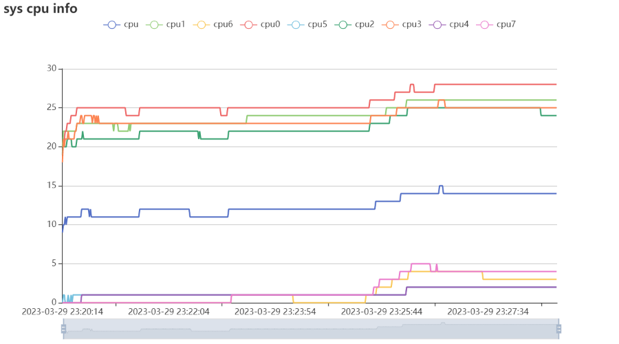
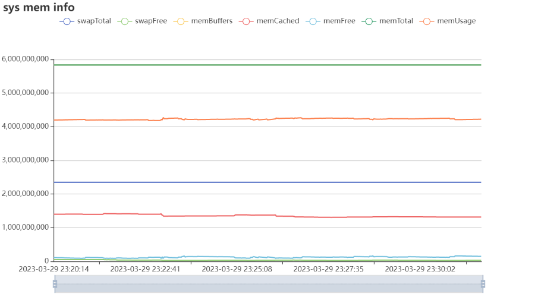
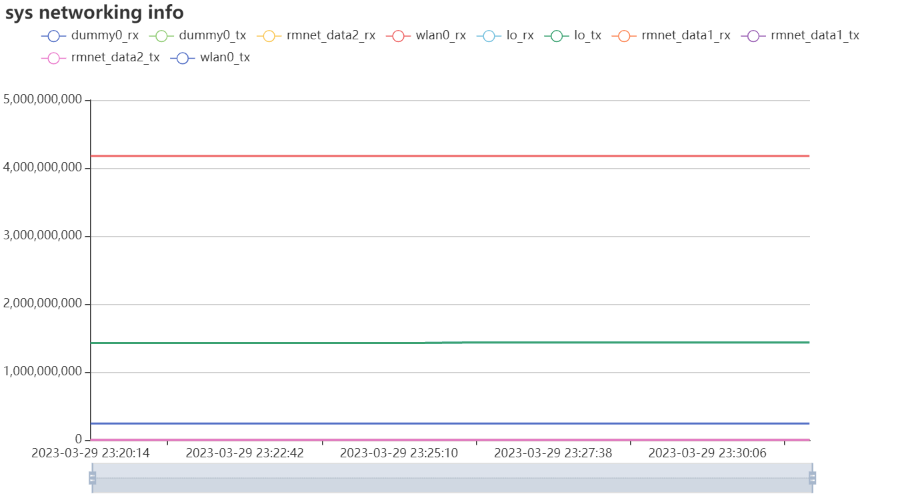
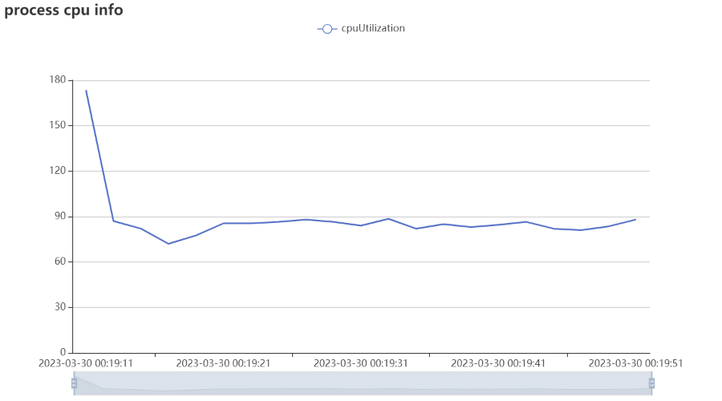
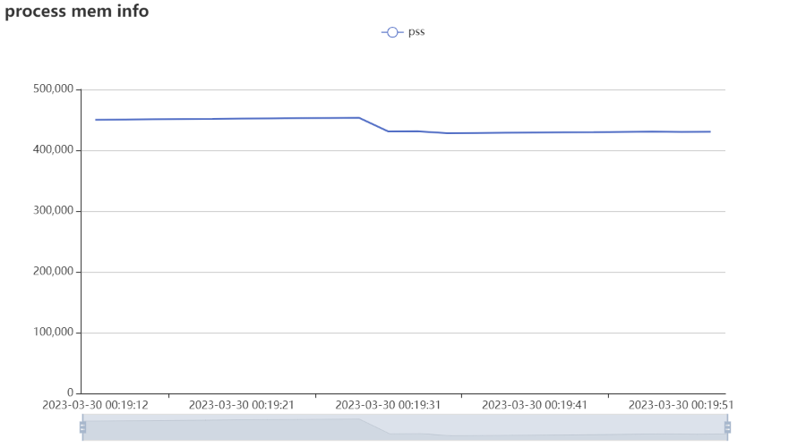

# perf-moblie

基于sonic性能数据采集，对Android或者iOS设备的性能数据以图表形式展示。

## Android

输入指令

```
perf-moblie android
```

然后在浏览器中访问默认的http://127.0.0.1:8081，可以获取到默认的系统CPU、系统内存、系统网络数据使用情况：







通常来说，我们需求对安卓app进行性能的监控，以B站为例，我们可以使用以下的指令进行监控：

```
perf-moblie android  -p tv.danmaku.bili -r 2000 --proc-cpu --proc-mem
```





#### 可用参数

| 快捷使用 | 选项名           | 描述信息                     |
| -------- | ---------------- | ---------------------------- |
| -h       | --help           | 获取帮助指南                 |
| -p       | --package string | 应用包名                     |
| -d       | --pid int        | 应用PID (默认 -1)            |
|          | --port int       | 服务端口 (默认端口 8081)     |
|          | --proc-cpu       | 获取进程cpu数据              |
|          | --proc-fps       | 获取进程fps数据              |
|          | --proc-mem       | 获取进程内存数据             |
|          | --proc-threads   | 获取进程线程数量             |
| -r       | --refresh int    | 数据刷新时间 (默认1000毫秒)  |
| -s       | --serial string  | 设备序列号（默认第一个设备） |
|          | --sys-cpu        | 获取系统cpu数据              |
|          | --sys-mem        | 获取系统内存数据             |
|          | --sys-network    | 获取系统网络数据             |
## iOS

输入指令

```
perf-moblie ios
```

然后在浏览器中访问默认的http://127.0.0.1:8081，可以获取到默认的系统CPU、系统内存、FPS、系统GPU使用情况

如果需要对iOS应用进行性能测试，可以参考以下指令：

```
perf-moblie ios -b com.apple.mobilesafari --proc-cpu --proc-mem
```

##### 可用参数

| 快捷使用 | 选项名        | 描述信息                                       |
| -------- | ------------- | ---------------------------------------------- |
| -u       | --udid        | 指定目标udid设备，不指定默认获取列表第一个设备 |
| -p       | --pid         | 指定PID数据（优先级高于指定包名）              |
| -b       | --bundleId    | 指定包名                                       |
|          | --port        | 服务端口（默认8081）                           |
|          | --sys-cpu     | 获取系统CPU数据                                |
|          | --sys-mem     | 获取系统内存数据                               |
|          | --sys-disk    | 获取系统磁盘数据                               |
|          | --sys-network | 获取系统网络上下行数据                         |
|          | --gpu         | 获取GPU数据                                    |
|          | --fps         | 获取FPS数据                                    |
|          | --proc-cpu    | 获取process CPU数据                            |
|          | --proc-mem    | 获取process 内存数据                           |
| -r       | --refresh     | 刷新间隔（默认1000毫秒）                       |
| -h       | --help        | 获取帮助指南                                   |

## Thanks

- https://github.com/go-echarts/statsview
- https://github.com/giannimassi/go-echarts-ws

